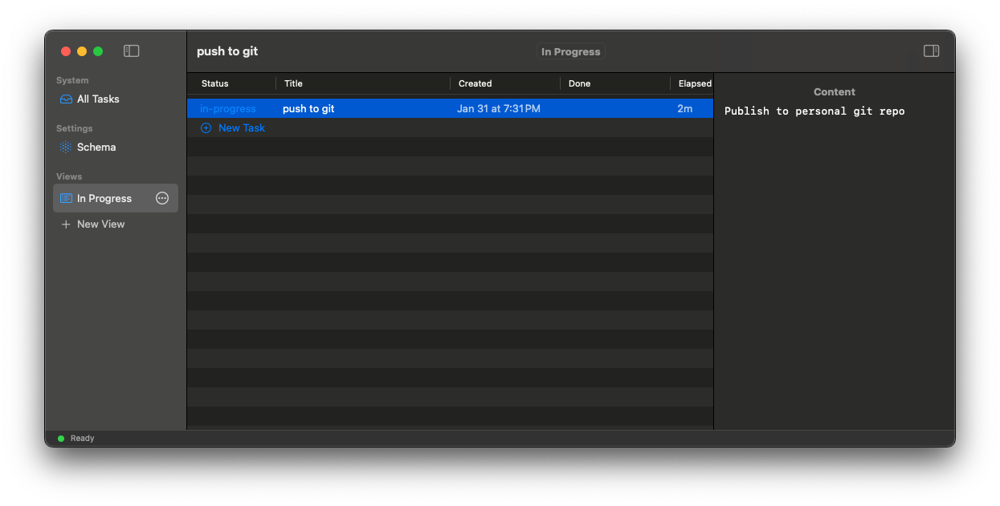

# Tasks

A native SwiftUI application for managing tasks using local Markdown files.



## 1. Data Specification

The application treats the filesystem as the single source of truth. Data is stored in human-readable Markdown format.

### 1.1. Task Model (`Task.swift`)

Every task corresponds to a single `.md` file in the root `tasks/` directory.

**Structure:**
- **Filename**: Derived from title (sluggified). E.g., `Buy Milk` -> `Buy-Milk.md`.
- **Frontmatter** (YAML): Stores structured attributes.
- **Body**: Stores freeform content.

**Fields:**
| Field | Type | Storage | Notes |
| :--- | :--- | :--- | :--- |
| `title` | String | Filename | Derived from filename (dashes -> spaces). |
| `status` | String | Frontmatter | Default: `todo`, `in-progress`, `done`. |
| `created` | ISO8601 Date | Frontmatter | Creation timestamp. |
| `done` | ISO8601 Date | Frontmatter | Completion timestamp. Auto-set when status → done. |
| `tags` | [String] | Frontmatter | *Model support only.* Indexed for search (`#tag`), not editable in UI. |
| `[custom]` | String | Frontmatter | User-defined schema fields. |

### 1.2. View Model (`ViewConfig.swift`)

Views are persistent queries saved as `.md` files in the `views/` directory.

**Structure:**
- **Frontmatter**: Defines the query logic and display settings.
- **Body**: Contains a *materialized* Markdown table of the results (for external readability).

**Fields:**
| Field | Type | Description |
| :--- | :--- | :--- |
| `type` | String | Constant `"view"`. |
| `query` | String | Filter logic (see §3 Query Engine). |
| `sort` | [String] | Array of `"field direction"` (e.g., `["created desc"]`). |

*Note: The materialized table uses fixed columns (status, title, created, done, elapsed) plus dynamic columns from `schema.json`.*

## 2. Schema System

The application uses a "Schema-on-Read" approach augmented by a `schema.json` configuration file for UI definitions.

**Location**: `tasks/schema.json`

### 2.1. Field Types
The `WorkspaceSchema` struct defines the capabilities of custom columns:

1.  **Text** (`.text`):
    *   Simple string input.
    *   Default type for new fields.
2.  **Categorical** (`.categorical`):
    *   Dropdown selection.
    *   Supports custom colors per option (defined in `schema.json`).
3.  **URL** (`.url`):
    *   Clickable link (Cmd+Click to open).
    *   Editable text input (Click to edit).

### 2.2. Operations
*   **Creation**: New fields are added to `schema.json` and become available in the inspector.
*   **Reordering**: `schema.order` array persists the user-defined column order.

## 3. Query Engine

The `QueryEngine` (`QueryEngine.swift`) runs in-memory filtering on the loaded task set.

**Comparison Operators**:
*   `==`: Case-insensitive equality.
*   `!=`: Inequality.
*   `contains`: Substring match.
*   `like`: Wildcard match (supports `%` at start/end).

**Logic Operators**:
*   `&&` / `and`: Logical AND.
*   `||` / `or`: Logical OR.

**Examples**:
*   `status == done`
*   `pm == "Justin" and status != done`
*   `#bug` (Variables starting with `#` search the `tags` array)

## 4. UI Layout

### 4.1. Toolbar
The app toolbar is organized as follows:
*   **Top Left**: View name (current view display).
*   **Top Center**: Search bar for filtering tasks.
*   **Top Right**: View controls and settings.

### 4.2. Search
Global search bar filters the current view's tasks in real-time.
*   **Shortcut**: `Cmd+F` focuses the search bar.
*   Searches across all columns displayed in the table.
*   Uses substring matching (case-insensitive).
*   Filters rows, keeping only those with matches.
*   **Highlights** matching substrings in table cells.
*   Resets when switching views.

### 4.3. Materialized View Output
When a `ViewConfig` is materialized to disk, the markdown file body contains a table matching the app's table view. Columns are determined by the global `schema.order` from `schema.json`, ensuring consistency between UI and file output.

## 5. Architecture

The app follows a Unidirectional Data Flow architecture managed by `Store.swift`.

### 5.1. Core Components
*   **Store**: Central state container. ObservableObject.
*   **FileWatcher**: Monitors filesystem events (add/modify/delete) and triggers Store reloads.
*   **TaskIndexEngine**: Parses raw files into `Task` structs.
*   **SchemaEngine**: Manages `schema.json` persistence.
*   **ViewProcessingEngine**: Evaluates queries and writes materialized view tables.

### 5.2. Write Lifecycle
1.  **UI Event**: User edits a field.
2.  **Optimistic Update**: Store updates the in-memory `Task` immediately.
3.  **Async Write**: `FileSystemDataSource` writes the changes to disk.
4.  **Debounce**: Rapid edits (e.g., typing) are debounced to prevent file thrashing.

### 5.3. Reading Lifecycle
1.  **File System Event**: `FileWatcher` detects change.
2.  **Coalesce**: Multiple events are grouped (200ms window).
3.  **Reload**: Store re-reads affected files.
4.  **Diff**: UI updates only if data changed.

### 5.4. Project Structure

```
tasks/
├── Package.swift        # Swift Package Manager definition
├── Sources/
│   ├── TasksApp/        # UI layer (Views, App entry point)
│   └── TasksCore/       # Logic layer (Models, Store, Engines)
│       ├── Data/        # Data sources (File system)
│       ├── Models/      # Core data structures (Task, ViewConfig)
│       └── Store/       # State management (Flux-like Store)
└── Tests/               # Unit tests
```

## 6. Installation

To install the app from a release:

1.  Download `Tasks.app.zip` from the [Releases page](https://github.com/NivekNey/tasks/releases).
2.  Unzip the file and move `Tasks.app` to your `/Applications` folder.
3.  **Important:** Because the app is not signed by an Apple Developer ID, you may see a "damaged" error. Run this command in Terminal to fix it:
    ```bash
    xattr -cr /Applications/Tasks.app
    ```
4.  Open the app. It will automatically create a `~/my-tasks` directory for your data.

## 7. Build & Run

**Prerequisites**:
- macOS 14.0+
- Swift 5.9+

**Commands**:
```bash
swift build
swift run
```
